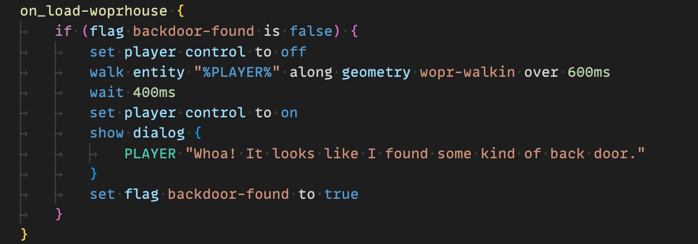

# MageGameScript Natlang <!-- This README is automatically generated, NO TOUCHY -->

Introducing "MageGameScript Natlang" — a simplified approach to writing game content for the DC801 Black Mage Game Engine (MGE).

## NOTICE!

This repo is deprecated, and the contents have officially moved to: https://github.com/DC801/BM-Badge

Current link is https://github.com/DC801/BM-Badge/tree/chapter_2/SD_Card/MAGE/editor/dependencies/natlang-parser -- if it's not there now, it might be someplace similar!

### Reasons

- Increasing integration with the badge game codebase itself, particularly for features requiring access to multiple files at once (sandalone "natlang" can handle only one file at a time)
- Increasing need to make radical changes to syntax (game source files can now be updated at the same time as the syntax definitions)
- Increasing realization that the lexer/parser portion of "natlang" would not be particularly useful to anyone else given how clumsy/specialized it is and given how many similar tools there are on the internet (the thought had been that the "mgs config" would be kept separate from the lexing/parsing machinery)
- Git subtrees are a pain in the butt
